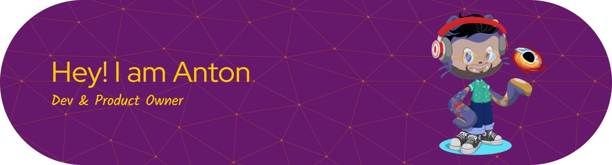

  

  🚀 Career switcher | 💚 Eco-design mindset | 🧠 Future Product Owner | 💻 Learning & Building

  
  
  
  
  

---

## 👤 About Me

I’m Antoine — currently transitioning into tech with a passion for **product ownership**,  
**eco-design**, and **building things that matter**.  

I love:
- 🎯 Value-driven & user-centric product development  
- 🧹 Clean architecture & clean code  
- 🔄 Agile & continuous improvement  
- 🌍 Tech with positive impact  
- 🤝 Collaboration, clarity, and meaningful work  

Currently:
- 🌱 Studying **Scrum Product Owner** (PSPO)  
- 🔭 Working on an **eco-design project**  
- 🛠 Improving my dev skills to understand stakeholders & deliver better products

---

## 🧰 Tech Stack I Use / Learn

  

---

## 📫 Contact

  💌 <strong>antoine.mgy.mnc@gmail.com</strong>

